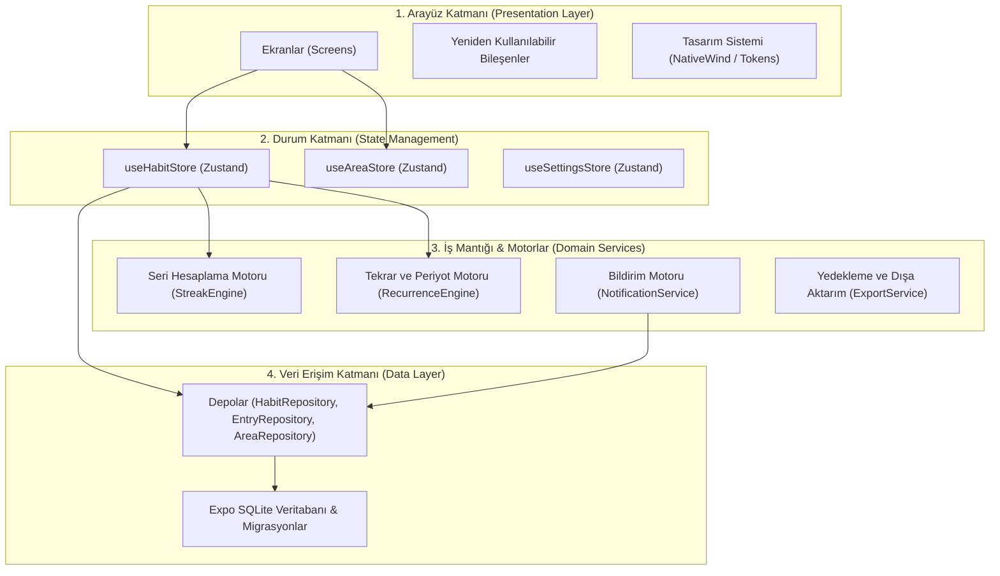

# Habbit — Yazılım ve Sistem Mimarisi (ARCHITECTURE.md)

Bu belge, Habbit uygulamasının modüler, sürdürülebilir, çevrimdışı öncelikli (offline-first) ve Android odaklı yazılım mimarisini tanımlar.

---

## 1. Mimari Prensipler

1. **Katmanlı Temiz Mimari (Clean Layered Architecture):**
   Arayüz (UI), iş mantığı (domain/business logic), durum yönetimi (state) ve veritabanı (data access) katmanları kesin çizgilerle birbirinden ayrılmıştır.
2. **Çevrimdışı Öncelikli ve Tek Gerçek Kaynağı (Single Source of Truth):**
   Tüm verilerin tek sahibi yerel **SQLite** veritabanıdır. Reaktif Zustand durumu, veritabanı işlemlerinin bellek içi yansımasıdır.
3. **İyimser Güncellemeler (Optimistic UI Updates):**
   Kullanıcı alışkanlık tamamlama düğmesine bastığı anda arayüz gecikmesiz (0ms) tepki verir, dokunsal geri bildirim (haptic) tetiklenir ve arka planda SQLite sorgusu çalıştırılır. Hata durumunda durum otomatik olarak geri alınır.
4. **Android Platform Optimizasyonu:**
   Android yaşam döngüsüne, bildirim kanallarına, donanım geri tuşuna ve kenardan kenara (edge-to-edge) sistem çubuklarına doğrudan uyumlu yapı.

---

## 2. Katmanlar ve Sorumluluklar



### 2.1. Arayüz Katmanı (Presentation Layer)
- **Ekranlar:** Yalnızca görsel düzeni ve kullanıcı etkileşimlerini yönetir; iş mantığı içermez.
- **Bileşenler (Atomic / Molecular Components):** Tekrar kullanılabilir, bağımsız, yüksek erişilebilirlikli kartlar, butonlar, modallar, giriş alanları.
- **Tasarım Sistemi:** NativeWind Tailwind sınıfları ve merkezi renk/boşluk değişkenleri.

### 2.2. Durum Katmanı (Zustand State Layer)
- `useHabitStore`: Aktif alışkanlıklar, bugünkü tamamlanma durumları, filtreleme mantığı.
- `useAreaStore`: Yaşam alanları listesi, alana ait metrikler ve seçili alan durumu.
- `useSettingsStore`: Kullanıcı tercihleri, bildirim saatleri, pano sıralaması, kompakt mod.
- **Kural:** Zustand store'ları doğrudan SQL sorgusu yazmaz; veri işlemleri için `Repositories` katmanını çağırır.

### 2.3. İş Mantığı ve Motor Katmanı (Domain Services)
- **StreakEngine:** Karmaşık tekrar modelleri (örn: haftada 3 kez veya her 2 günde bir) için serileri hesaplar, en uzun seriyi bulur ve serinin bozulup bozulmadığını doğrular.
- **RecurrenceEngine:** Belirli bir tarihte (örneğin 14 Ekim) bir alışkanlığın aktif olup olmadığını belirler.
- **NotificationEngine:** Android bildirim kanallarını oluşturur, alışkanlık saatlerine göre yerel alarmları kurar veya günceller.
- **ExportService:** SQLite verilerini JSON / CSV formatına dönüştürür ve dosyadan geri yükler.

### 2.4. Veri Katmanı (Data Access Layer)
- **Expo SQLite:** `openDatabaseSync` ile modern, senkron/asenkron kararlı SQLite erişimi.
- **Repository Pattern:** `HabitRepository`, `EntryRepository`, `AreaRepository`, `SettingsRepository` sınıfları tip güvenli SQL sorgularını yürütür.
- **Migrasyon Yöneticisi (Database Migrator):** Veritabanı sürümünü (`PRAGMA user_version`) kontrol eder ve şema güncellemelerini sıralı olarak uygular.

---

## 3. Klasör ve Dizin Yapısı (Folder Structure)

```
/
├── assets/                  # İkonlar, yazı tipleri, splash ve adaptive simgeler
├── src/
│   ├── app/                 # Expo Router veya React Navigation kökü
│   │   ├── (tabs)/          # 4 Ana Sekme: index (Bugün), calendar, stats, areas
│   │   ├── habit/           # Alışkanlık Ekle/Düzenle, Alışkanlık Detay ekranları
│   │   ├── settings/        # Ayarlar, Arşiv, Yedekleme ekranları
│   │   └── _layout.tsx      # Kök yerleşim ve Tema sağlayıcı
│   ├── components/          # Paylaşılan UI bileşenleri
│   │   ├── common/          # Buton, Kart, Modal, İlerleme Çubuğu, Rozet
│   │   ├── habit/           # HabitCard, HabitQuickAction, HabitFilterBar
│   │   ├── calendar/        # MonthMatrix, DayDetailDrawer
│   │   ├── stats/           # MetricCard, ConsistencyChart, StreakHistory
│   │   └── layout/          # ScreenContainer, AppHeader, TabBar
│   ├── db/                  # Veritabanı katmanı
│   │   ├── client.ts        # SQLite veritabanı bağlantısı
│   │   ├── schema.ts        # SQL DDL şemaları ve tablo tanımları
│   │   ├── migrations/      # Sürüm bazlı SQL migrasyon dosyaları
│   │   └── repositories/    # Veri erişim sınıfları
│   │       ├── habitRepository.ts
│   │       ├── entryRepository.ts
│   │       ├── areaRepository.ts
│   │       └── settingsRepository.ts
│   ├── services/            # Çekirdek iş motorları
│   │   ├── streakEngine.ts
│   │   ├── recurrenceEngine.ts
│   │   ├── notificationService.ts
│   │   └── backupService.ts
│   ├── store/               # Zustand durum depoları
│   │   ├── useHabitStore.ts
│   │   ├── useAreaStore.ts
│   │   └── useSettingsStore.ts
│   ├── types/               # TypeScript tip tanımları (Habit, Entry, Area, vb.)
│   ├── constants/           # Renkler, ikon adları, Türkçe metin sabitleri
│   └── utils/               # Tarih biçimlendirme, matematik ve platform yardımcıları
├── ARCHITECTURE.md
├── DATA_MODEL.md
├── FEATURES.md
├── PROJECT.md
├── SCREENS.md
├── TASKS.md
└── UI_RULES.md
```

---

## 4. Android Sistem Entegrasyonları

### 4.1. Bildirim Kanalları (Notification Channels)
Uygulama açılışında (`App.tsx` veya kök yerleşimde) Android için şu kanallar tanımlanır:
1. `habit_reminders_channel`:
   - Ad: "Alışkanlık Hatırlatıcıları"
   - Önem: `Importance.HIGH` (Sesli ve banner bildirimi)
   - Titreşim: Açık
2. `daily_review_channel`:
   - Ad: "Günlük Değerlendirme"
   - Önem: `Importance.DEFAULT`
   - Titreşim: Açık

### 4.2. Kenardan Kenara (Edge-to-Edge) ve Sistem Çubukları
- Durum çubuğu (Status Bar): Şeffaf arka plan, açık renkli simgeler (`light-content`).
- Gezinme çubuğu (Navigation Bar): Şeffaf arka plan, arayüzün alt gezinme çubuğunun arkasına akması (`react-native-safe-area-context` ile güvenli alan boşlukları).

### 4.3. Android Donanım Geri Tuşu (BackHandler)
- Modallar veya detay sayfaları açıkken donanım geri tuşuna basıldığında sayfa veya modal kapatılır.
- Ana ekranda geri tuşuna basıldığında uygulamadan doğrudan çıkmak yerine gerekirse "Çıkmak için tekrar basın" geri bildirimi sunulur.

### 4.4. Dokunsal Geri Bildirim (Haptic Feedback)
- Alışkanlık tamamlandığında: `Haptics.notificationAsync(NotificationFeedbackType.Success)`
- Sayaç artırma/azaltmada: `Haptics.impactAsync(ImpactFeedbackStyle.Light)`
- Silme / Arşivleme onayında: `Haptics.notificationAsync(NotificationFeedbackType.Warning)`
