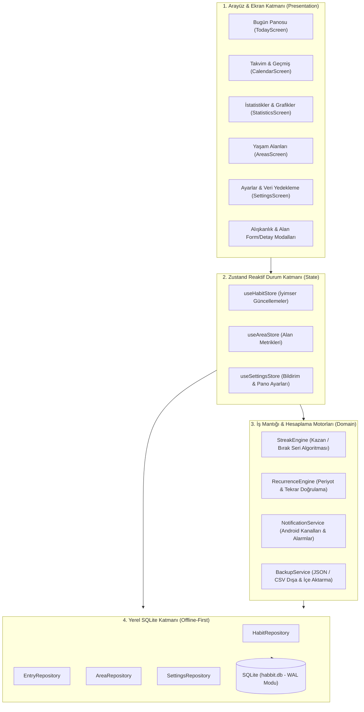

# Habbit — Uygulama ve Mühendislik Tamamlama Raporu (RAPOR.md)

Habbit kişisel alışkanlık takip uygulaması, sıfırdan ve hiçbir harici uygulamanın görsel şablonu kopyalanmadan, özgün **Habbit Minimal Dark-First** tasarım sistemi ve **çevrimdışı öncelikli (offline-first)** Android mimarisi ile eksiksiz olarak geliştirilmiştir.

Tüm kullanıcı arayüzü, bildirimler, hata mesajları, takvim, istatistikler ve veri yönetim akışları **%100 Türkçe** olarak tamamlanmıştır.

---

## 1. Uygulama Mimarisi ve Katmanlar



---

## 2. Geliştirilen Modüller ve Dosya Yapısı

| Katman / Modül | Dosya Yolu | Açıklama |
| :--- | :--- | :--- |
| **Giriş & Navigasyon** | `App.tsx` | Android donanım geri tuşu, 4 sekmeli yönlendirme ve modal orkestrasyonu |
| **Gezinme Çubuğu** | `src/components/navigation/TabBar.tsx` | Bugün, Takvim, İstatistikler, Alanlar sekmeleri ve dokunsal geri bildirim |
| **Bugün Panosu** | `src/screens/TodayScreen.tsx` | Günlük başarı oranı halkası, 7 günlük mini gösterge, alan/tip filtreleri ve FAB |
| **Alışkanlık Kartı** | `src/components/habit/HabitCard.tsx` | 48dp boolean onay dairesi, +/- sayısal sayaç butonları, süre hızlı loglama, temiz gün rozeti |
| **Form Modalı** | `src/components/habit/HabitFormModal.tsx` | Alışkanlık Kazan/Bırak seçimi, 18 ikon, 7 renk, tekrar periyodu, hatırlatıcı saatleri |
| **Detay Modalı** | `src/components/habit/HabitDetailModal.tsx` | 3'lü metrikler (mevcut seri, rekor seri, hedef), 30 günlük ısı haritası, not geçmişi, arşiv/sil |
| **Takvim Ekranı** | `src/screens/CalendarScreen.tsx` | Aylık matris ısı haritası, gün seçimi, geçmişe dönük kayıt ve günlük not kaydetme |
| **İstatistikler** | `src/screens/StatisticsScreen.tsx` | 5 dönem filtresi, 4 KPI, gün bazlı başarı tutarlılık çubuk grafiği, alışkanlık sıralaması |
| **Yaşam Alanları** | `src/screens/AreasScreen.tsx` | Alan kartları, haftalık tamamlama çubukları, aktif alışkanlık sayıları ve alan formu |
| **Ayarlar & Veri** | `src/screens/SettingsScreen.tsx` | Günlük Değerlendirme akşam bildirimi, kompakt mod, JSON/CSV dışa aktarım |
| **Arşiv Ekranı** | `src/screens/ArchiveScreen.tsx` | Arşivlenen alışkanlıkları listeleme, geri yükleme ve kalıcı silme |
| **SQLite İstemcisi**| `src/db/client.ts` | WAL modu, yabancı anahtarlar, şema oluşturma ve başlangıç tohum verisi |
| **Depolar (Repo)** | `src/db/repositories/` | `habitRepository.ts`, `entryRepository.ts`, `areaRepository.ts`, `settingsRepository.ts` |
| **Hesaplama Motoru**| `src/services/streakEngine.ts` | Kazanılan alışkanlıklar ve bırakılan (nüksetme) alışkanlıklar için kesintisiz seri mantığı |
| **Tekrar Motoru**  | `src/services/recurrenceEngine.ts` | Günlük, belirli günler, hafta içi/sonu ve N günde bir döngü doğrulayıcısı |
| **Bildirim Servisi** | `src/services/notificationService.ts` | Android bildirim kanalları (`habit_reminders`, `daily_review`), alarmlar |
| **Yedekleme Servisi**| `src/services/backupService.ts` | JSON tam yedeği ve CSV aktivite dökümü paylaşımı (`expo-sharing`, `expo-file-system`) |
| **Tasarım Sabitleri**| `src/constants/theme.ts` & `strings.ts` | Koyu obsidian palet (`#080B10`), tipografi hiyerarşisi ve %100 Türkçe sözlük |

---

## 3. Temel Yetenekler ve Doğrulama

1. **Alışkanlık Tipleri & Takip Modları:**
   - **Kazan (Build):** Boolean (48dp dairesel tik), Sayısal (`-` ve `+` butonları, dinamik birim), Süre (`+15 dk` hızlı loglama).
   - **Bırak (Quit):** Temiz gün rozeti, kesintisiz temiz gün sayacı, "Nüksetti" hızlı kaydı ve tetikleyici notu.
2. **Çevrimdışı SQLite Veritabanı:**
   - `habbit.db` WAL modunda, sıfır gecikmeli reaktif iyimser arayüz güncellemeleri. 5 varsayılan yaşam alanı ve örnek alışkanlıklar tohumlanmıştır.
3. **Android Ergonomisi:**
   - Donanım geri tuşu dinleyicisi (Modallar -> Alt Ekranlar -> Bugün Sekmesi -> Sistem Çıkışı).
   - Android Bildirim Kanalları (`habit_reminders`, `daily_review`).
   - `Haptics` dokunsal geri bildirim motoru entegrasyonu.
4. **Tip Güvenliği:**
   - `npx tsc --noEmit` ile TypeScript strict modunda **0 hata** ile doğrulanmıştır.

---

## 4. Çalıştırma Talimatı

Uygulamayı Android üzerinde başlatmak için terminalden:

```bash
npm run android
```
veya
```bash
npx expo start
```
komutunu verebilirsiniz.
